# SwingClips (home setup fork) ⛳️

A fork of Danny's [SwingClips](https://github.com/danny2p/swingclips) web app, grown into a home
golf-sim system. Two phones record each swing when they hear the strike (face-on and down the line),
a home server analyzes every clip and serves a review page to any browser on the network, and each
swing is tagged with the Square Omni's numbers for that shot.

```
 Phones (capture app)         Home server (http://192.168.86.250:8000)       Sim laptop (Square Omni)
 face-on + down the line:     clips, pose, key positions, review page  <---  Square watcher: each new
 each hears the strike ->     (pairs the two angles of each swing)           shot from Square's app
 2 s + 2 s clip, uploads      Ready bar: starts/stops both phones
```

## What you see

*The pictures use made-up data ([tools/demo](tools/demo)).*

- **Did your last session go better?**  
  A session score ring (0 to 100) and four plain tiles (good shots, on line, solid strikes, distance) compare today's session against your usual benchmarks and the session before.
  <br>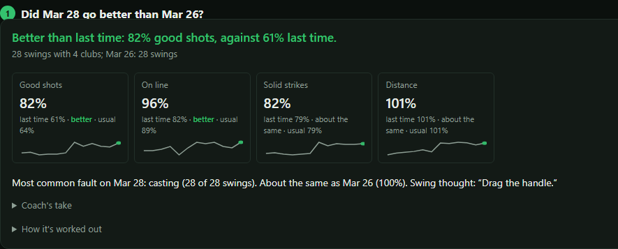

- **Your game at a glance**  
  A five-skill radar against your usual benchmarks, with strokes gained against a tour player per session and per club.
  <br>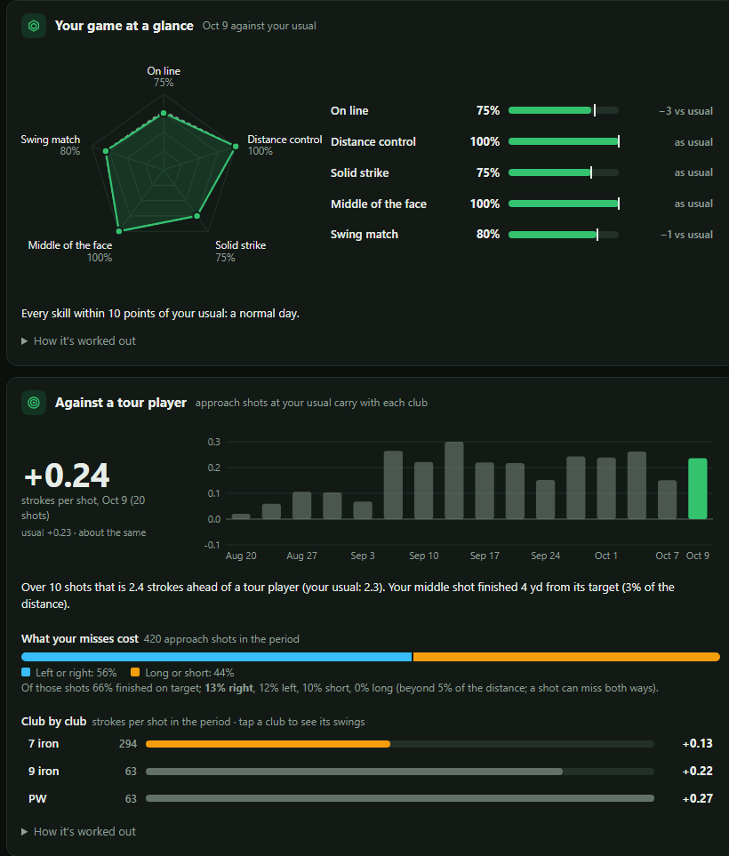

- **What should I work on, and is it working?**  
  Keeps you on one focus at a time with its drill and swing thought, and tracks whether the move and its ball-flight results have changed across sessions.
  <br>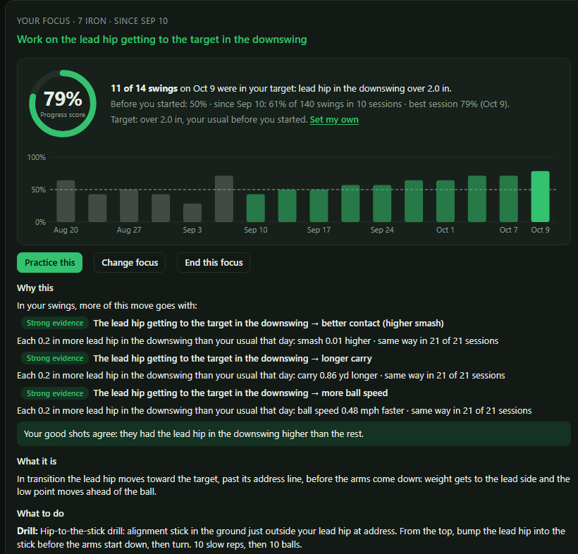

- **Around the target**  
  Where shots finished around your target distance on the target line, strokes gained per shot, and what sideways and distance misses cost.
  <br>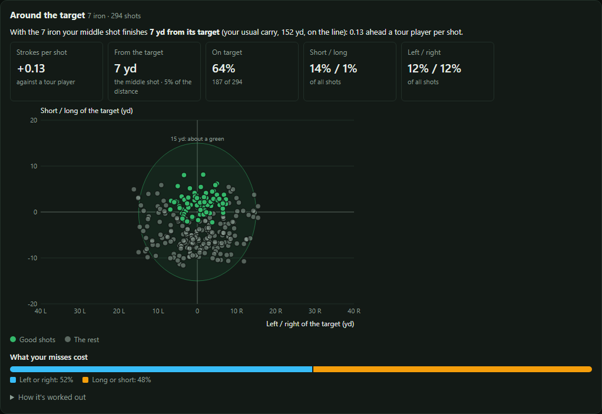

- **Ball flight**  
  The nine ball flights from start line against curve, your usual flight, every shot from above, and session-by-session trends.
  <br>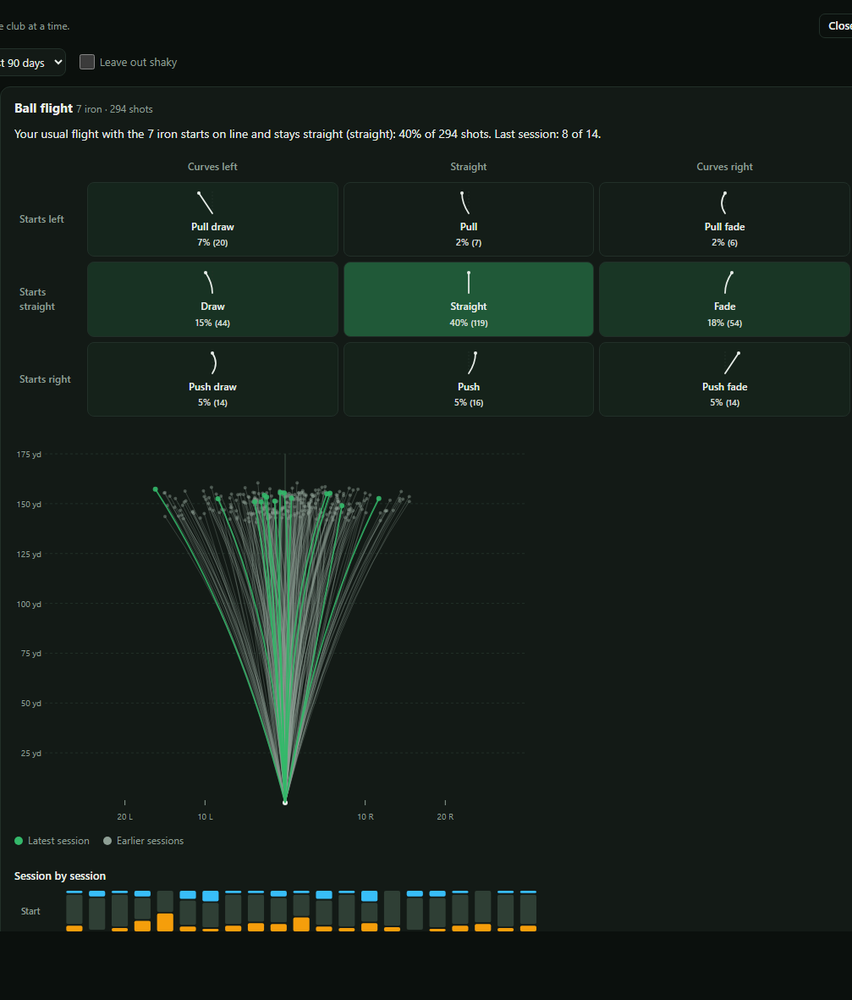

- **What goes with what**  
  Chart any delivery or body move against any result over every session, against that day's usual, with thirds and ranked links.
  <br>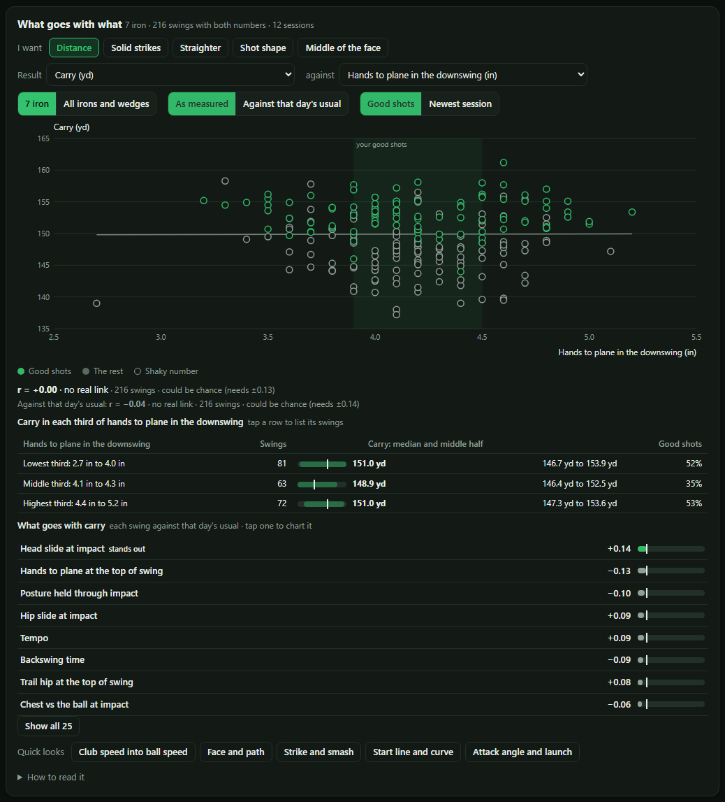

- **Where on the face?**  
  A strike heat map on the club face for each club: where your strikes land, your usual spot, and the latest session's shots.
  <br>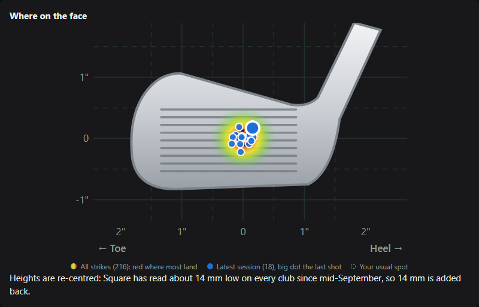

- **Swing checkpoints**  
  Indicator tiles for every body number against its good-shot range: moment tags (Rhythm, Top, Downswing, Impact), big colored values with status in words, and a range track. Filter chips across the top, favorite stars, and a detail panel with range bars, Over time, Swings outside, and Make this my focus.
  <br>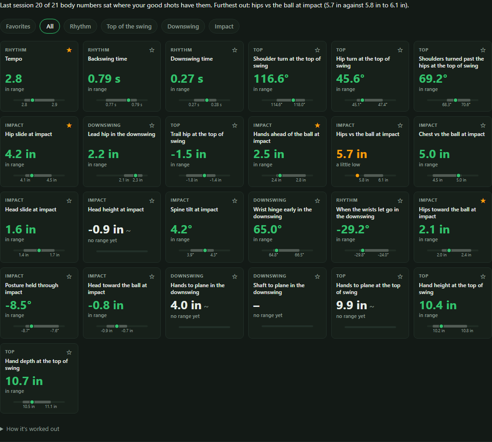

- **This swing under the video**  
  A strip of your favorite indicator tiles right under the video for the swing on screen, showing this swing's numbers against the club's good-shot range and jumping to their key moments.
  <br>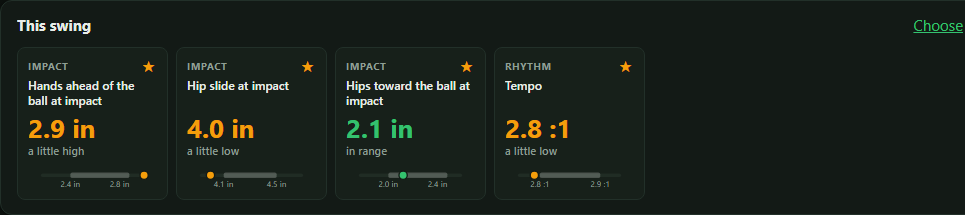

- **Get ready before hitting**  
  Checks both camera phones, microphone strike triggers with sensitivity controls, launch monitor, and server at a glance before you swing.
  <br>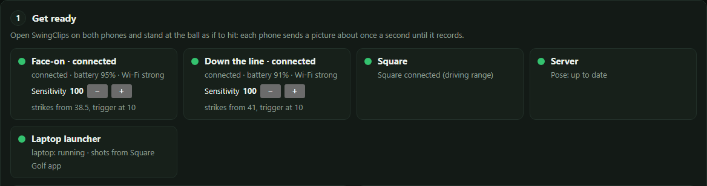

- **The coach's take after each session**  
  A grounded coaching take right after you stop: how it went, how your focus is progressing, and the one thing for next time.
  <br>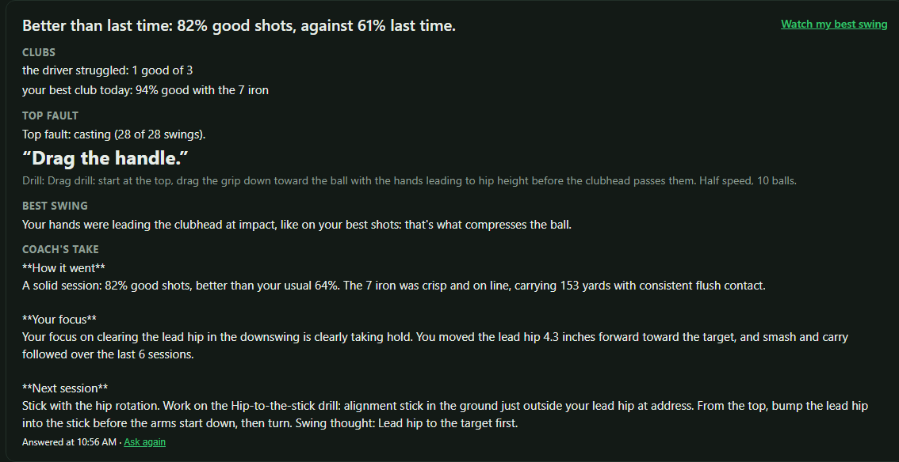

- **AI coach setup**  
  Pick an AI provider (Claude, OpenAI, Gemini, or any OpenAI-compatible service, local models included). Your API key stays safe on your home server, and you can inspect the exact session brief sent out.
  <br>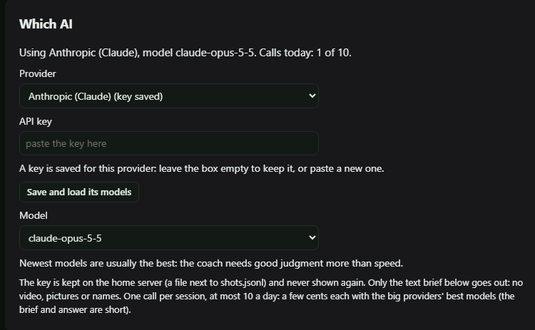

- **Ask the coach a question**  
  Ask about specific clubs, tendencies, or strike changes. Answers are grounded in your last 30 days of ball flight, delivery numbers, and focus progress.
  <br>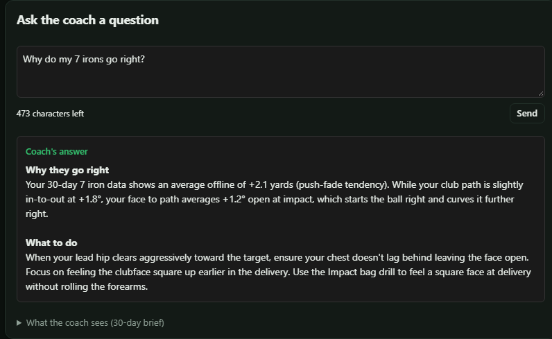

- **On a phone**  
  Every page works at phone width, so the review page can sit on a phone in the bay.
  <br>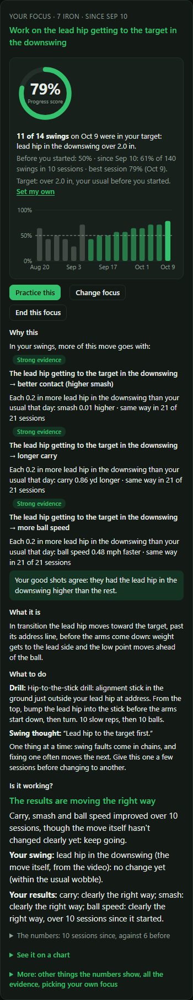

## Getting going (once)

1. **Server** (the always-on Windows PC): clone this repo to `D:\SwingClips\app` and run
   `server\Start server.cmd`. The first run sets up Python by itself. To use the RTMPose body
   model (more accurate than MediaPipe; scored on hand-labeled swings), create
   `server\settings.cmd` containing `set SWINGCLIPS_POSE_BACKEND=rtmpose-m` and restart. The model
   downloads on the first start.
2. **Phones**: build the capture app on the dev PC and install it on both (see "Dev PC" below). In
   the app, set one phone to **Face-on** and the other to **Down the line**. The server address is
   `http://192.168.86.250:8000`.
3. **Sim laptop**: the `Dropbox\SwingClips` folder holds `Start golf.cmd`, `square-watcher.ps1`
   and `start-golf.ps1` (copies of `relay/`). Run `Start golf.cmd -Startup` once to have it start at
   every sign-in.
4. **Review page**: `http://homeserver:8000` on a PC, or `http://192.168.86.250:8000` on a phone.

Full setup, build, deploy and network details are in **[HOME-SETUP.md](HOME-SETUP.md)**.

## A session

1. **Phones**: open **SwingClips** on both and leave them on their stands. Stand at the ball: one
   phone says how both cameras see you ("Both cameras look good", or what to fix).
2. **Laptop**: `Start golf.cmd` (if it didn't start with Windows). It opens Square Golf's app, the
   watcher, and the **Start page** (`/start`) in the browser: checks, both cameras' pictures, and
   **Start recording** (each phone says "Recording"). `-StartCameras` starts the phones as soon as
   they connect instead (the old way).
3. **Square's app**: pick the driving range and hit balls. The Start page lists each swing and
   whether its Square shot paired. About a minute after the first swing, a phone says "First
   swing: both cameras saw you, Square paired", or what's wrong. After that it only speaks up about
   problems.
4. **Done**: **Stop both**.

## The review page

Tabs along the top (along the bottom on a phone): **Swings**, **Progress**, **Practice**,
**Cameras** and **Tools**. On a phone, "Add to Home screen" installs it like an app. **?** lists
the keyboard shortcuts.

The **Swings** tab opens on a coaching card for each swing (what happened, why, and what to try), with
**Advanced data** for the underlying launch and body numbers. Named faults come with their severity, swing thought
and drill from `coach.js`. Keys `1`–`8` jump between key positions (setup, top, impact, etc.).

- **Ready bar** (under the tabs): both phones, Square, framing and the server's queue at a glance,
  with Start and Stop for both phones or each one.
- **Swings**: the list by session (a club filter at the top, each swing with its club, carry and
  coaching state dots) and the open swing: both angles in sync, scrubber with key positions (keys 1-8),
  play (Space), frame steps (← →), and full screen (F). **Compare…** puts it side by side with another swing.
  Numbers that can't be trusted are greyed with a **~** (hover for why).
- **Trends** (per session, in the list): opens with the session's story: how it went against earlier ones,
  its top fault, and body numbers against shot results.
- **Progress**: the two steps across all clubs (how did the last session go, and what should I work on —
  with whether it's working inside it), with **One club at a time** below: four story tiles (Good shots,
  On line, Solid strikes, Distance), the club's top fault and trend, and all session numbers folded under
  "All numbers from this session".
- **Practice**: practise your #1 priority in one tap; play games (Combine, Wedge ladder, Driving, etc.) with
  a big target (readable from 2 m), shot count, running score in plain words, and post-game comparison; or pick a
  number and range yourself.
- **Tools**: everyday tools first (Start a session, Tripod setup, Week for coach, AI coach, Update server),
  tracking and setup checks below (3D calibration, Labels, Club check, P4 check, Wrist check, Night report, Shutter test).

**Capture app (0.12)**: the camera fills the screen with which angle and mode it is and whether
it's recording; below it the status, the server, one big Start / Stop, and the strike trigger
(level bar and sensitivity; also set from the Start page, recording or not, from 0.12). Everything
else (angle, mode, shutter, server, voices, auto-start) is under **Settings**; the camera ones are
locked while recording.

## Common commands

### Server (Command Prompt; these work from any folder)

```bat
:: Deploy the latest version: pull, then stop and start
git -C D:\SwingClips\app pull
"D:\SwingClips\app\server\Stop server.cmd"
"D:\SwingClips\app\server\Start server.cmd"

:: Is the server up? (prints the server's clock if it is)
curl http://localhost:8000/api/time

:: Use RTMPose (delete the file to go back to MediaPipe); restart afterwards
echo set SWINGCLIPS_POSE_BACKEND=rtmpose-m> D:\SwingClips\app\server\settings.cmd

:: How accurate the tracking is, against your hand labels
cd /d D:\SwingClips\app\server
.venv\Scripts\python.exe eval.py

:: How long a clip takes and where the time goes, with the speed settings as before and as set
:: now; RTMPose and the club model on the CPU vs a GPU, if one is installed
:: (docs/performance.md, "Keeping up during a session" and "Using a GPU")
.venv\Scripts\python.exe bench_models.py

:: Do the speed settings score no worse on the labeled clips? (dev PC or server, with the clips)
.venv\Scripts\python.exe bench_models.py --accuracy
```

- `settings.cmd` can also put the ONNX models on a GPU (`SWINGCLIPS_ORT_PROVIDER=dml` or `cuda`,
  with `SWINGCLIPS_REQUIREMENTS` naming the matching package file); off by default, see
  docs/performance.md, "Using a GPU".
- Less work a clip, so the server keeps up with a swing every ~20 s: MediaPipe on every 4th frame
  after the swing, a cheaper picture for it, the clip split between the workers by cost (on by
  default; `settings.cmd` can put each back), and a faster shaft search and empty scene (the same
  numbers). See docs/performance.md, "Keeping up during a session".
- `Start server.cmd` runs the server in its window. Ctrl+C or closing the window stops it (answer
  Y to "Terminate batch job"). After a change of body model or of the analysis, the server
  analyzes older clips again in the background, newest first, while new swings go first.
- After a reboot the auto-start task runs the server **in the background**, with no window. It
  only shows as `python.exe` on Task Manager's Details tab. `Stop server.cmd` stops it anyway (it
  finds the server by port 8000), and starting a second copy fails with "only one usage of each
  socket address". To check auto-start after a reboot, open http://192.168.86.250:8000 on your
  phone without logging in to the server.

### Sim laptop

```bat
:: Square Golf's app + the Square watcher (each only if it isn't running already)
"%USERPROFILE%\Dropbox\SwingClips\Start golf.cmd"

:: ...and at every Windows sign-in from now on (delete the Startup shortcut to undo)
"%USERPROFILE%\Dropbox\SwingClips\Start golf.cmd" -Startup
```

It finds Square's app in the Start menu's app list (Microsoft Store apps too); if it can't, put the
path of its shortcut or .exe, or its app ID, in `square-app.txt` next to `Start golf.cmd`. What it
did each time is in `start-golf-log.txt` there. `Square watcher.cmd` still runs the watcher alone.

**Shots through Square's GSPro connector (optional).** Instead of Square's app, Square's official
SQG GSPro Connect can send each shot about a second after the strike (instead of ~11 s):

```bat
:: Close Square Golf's app first: the Omni takes one Bluetooth connection.
"%USERPROFILE%\Dropbox\SwingClips\Start golf (GSPro).cmd"
```

It starts the shot listener (which stands in for GSPro; type a club code such as `I7` in its window
and press Enter to change club) and opens the connector. The connector sends no carry or club
speed: the server works out carry, total, offline and apex from the ball (within ~2 yd of Square's
carry, marked "calc." on the review page), and club speed and smash stay empty. `Start golf.cmd`
is still the usual setup; to make the connector the default, put `gspro` in `shot-source.txt` next
to it. Copy `Start golf (GSPro).cmd`, `Shot listener.cmd` and `shot-listener.ps1` to
`Dropbox\SwingClips` along with the updated `start-golf.ps1`.

### Dev PC

```bash
# Build the phone app (JDK 21 + Gradle 8.9), then install on a phone (USB, or Wi-Fi adb)
cd capture
JAVA_HOME=~/.jdks/jbr-21.0.11 ~/.gradle/wrapper/dists/gradle-8.9-bin/*/gradle-8.9/bin/gradle assembleDebug
adb install -r app/build/outputs/apk/debug/app-debug.apk
adb connect 192.168.86.17:5555          # the down-the-line phone over Wi-Fi (after adb tcpip 5555)

# Server tests (Python + the page's JavaScript)
cd server
.venv/Scripts/python.exe -m unittest discover tests
node --test tests/*.test.js     # PowerShell: node --test (Get-ChildItem tests\*.test.js).FullName

# Refresh the labeled swings in the repo from the server, then tune key positions on them
.venv/Scripts/python.exe fixtures_export.py
.venv/Scripts/python.exe tune_positions.py
```

- `adb` is in `%LOCALAPPDATA%\Android\Sdk\platform-tools`.

## What's in the repo

| Folder | Runs on | What it does |
| --- | --- | --- |
| `capture/` | Android phones (9+) | Kotlin/Camera2 app. Keeps the last few seconds of video in memory and cuts a clip 2 s either side of each strike (240/120/30 fps; shutter Auto or fixed). Each phone is face-on or down the line. Uploads each clip, reports in to the server (start/stop from the review page), speaks camera setup, first-swing and practice results. |
| `server/` | Home server (Windows) | Python/FastAPI. Stores clips; runs pose on every frame (MediaPipe, or RTMPose through ONNX, on the CPU or a GPU), finds the ball, impact and club shaft; works out key positions P1-P8 and swing numbers from both angles; clip quality; trust per number; good-shot ranges; practice mode; the labeling mode and scorecard (`eval.py`); two-camera 3D (off until calibrated). Serves the review page. |
| `relay/` | Sim laptop | `square-watcher.ps1` reads new shots from Square Golf's local shot database and posts them to the server, which pairs each with its swing by time; `Start golf.cmd` starts Square's app and the watcher. `Start golf (GSPro).cmd` uses `shot-listener.ps1` instead, which stands in for GSPro so Square's GSPro connector sends shots (optional; carry worked out by `server/ballflight.py`). |
| `train/` | Gaming PC (GPU) | Trains the club keypoint model (YOLO-pose) from labeled frames. |
| `docs/` | | The details per part: phones, review page, scorecard, performance, club model, 3D, relay, key positions. |
| `tools/` | Dev PC | `devproxy.js` (a checkout's pages with the server's real data), `browser-check.js` (click-test a page in headless Edge), and `tools/demo/` (demo server and data generator for screenshots). |
| `public/` | Home server | The MediaPipe body model, and the downloaded ONNX models (`public/models`, not in git). |

## Credits and license

The original SwingClips web app, including its sound-triggered strike detection, is by
[Danny](https://github.com/danny2p/swingclips) ([Garage Golf on YouTube](https://www.youtube.com/@garagegolfers)).
MIT License. The original web app itself (Next.js, `src/`) was removed from this fork on
2026-09-30; it's in the git history before then.
